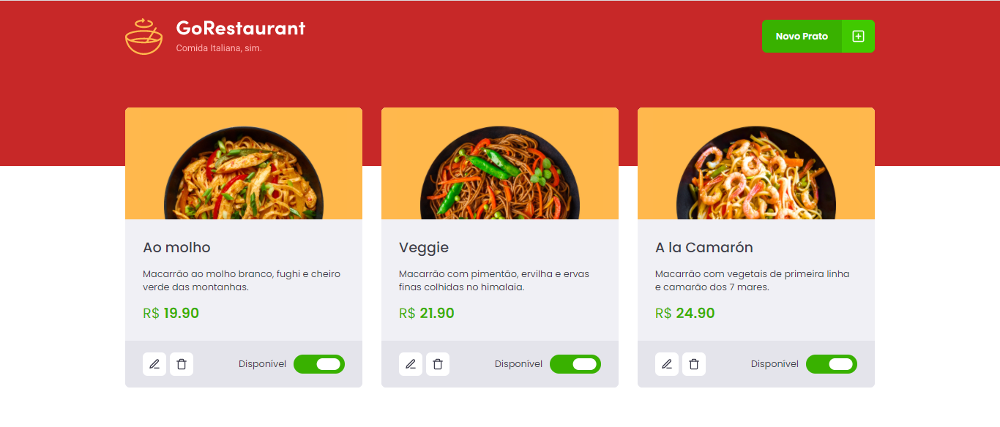
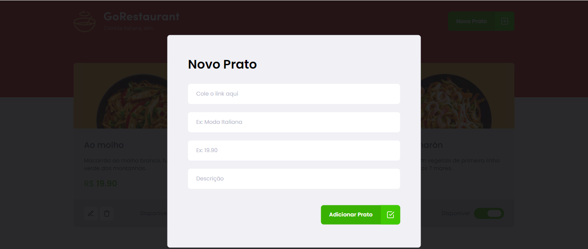

# desafio10
Go Restaurant - GoStack

# Status
<h4 align="center"> 
	🚧  Go Restaurant Web 🚀 Concluído  🚧
</h4>

# Features

- [x] Cadastro de pratos(comidas)
- [x] Edição dos pratos(comidas)
- [x] Exclusão dos pratos(comidas)
- [x] Definir disponibilidade dos pratos(comidas)

# Banner

<h1 align="center">
  
</h1>

<h1 align="center">
  
</h1>

# Como rodar a aplicação

### Pré-requisitos

Antes de começar, você vai precisar ter instalado em sua máquina as seguintes ferramentas:
[Git](https://git-scm.com), [Node.js](https://nodejs.org/en/). 
Além disto é bom ter um editor para trabalhar com o código como [VSCode](https://code.visualstudio.com/)

### 🎲 Rodando o Back End (servidor) e Web (frontend)

```bash
# Clone este repositório
$ git clone <https://github.com/cesarvaz-filho/desafio10>

# Vá para a pasta backend
$ cd desafio10

# Instale as dependências
$ npm install ou yarn

# Execute a aplicação em modo de desenvolvimento
$ yarn start (para abrir a page web)
$ yarn json-server server.json -p 3333 (para o server)

# O servidor inciará na porta:3333
```

# Autor

Feito com dedicação por César Vaz.
- [GitHub](https://github.com/cesarvaz-filho)
- [Linkedin](https://www.linkedin.com/in/cesar-vaz-059667175/)
- Email: cesar_augusto_perfil@hotmail.com
- Entre em contato!👋🏽🚀

# Licença
MIT
